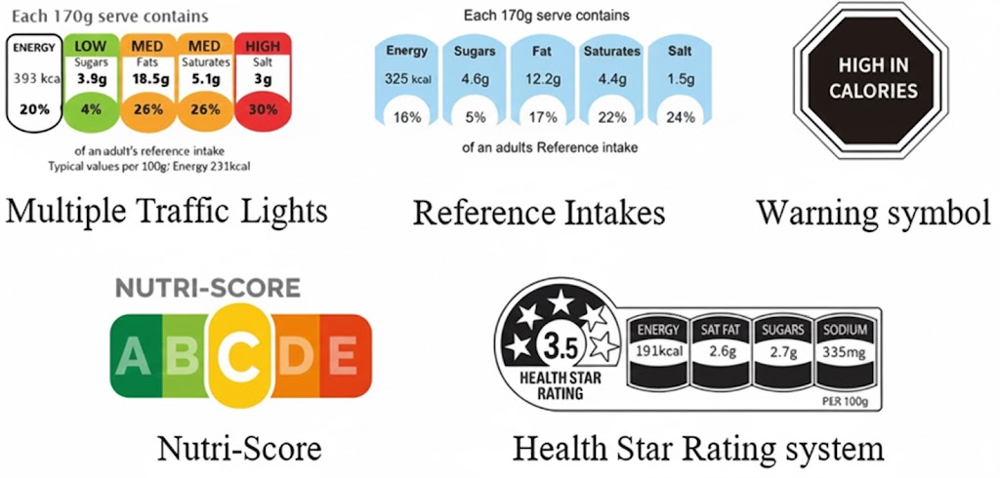
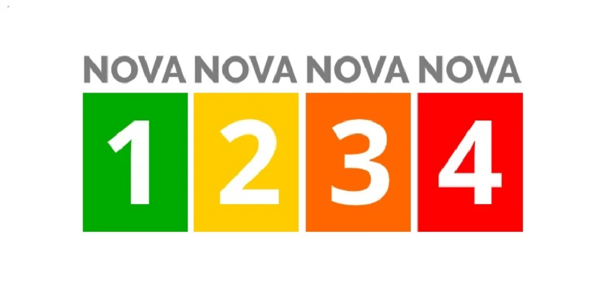

# WHO Food Safety Navigator

This project is a submission for the [Kaggle Agents Intensive Capstone project](https://www.kaggle.com/competitions/agents-intensive-capstone-project/overview).

It project hosts a set of AI agents designed to navigate and provide verdicts on food safety inquiries using the **Google Agent Development Kit (ADK)** and **Gemini API**.

## Project overview

### The global need for clear food-health intelligence 🥑

Today, consumers still do not truly understand the full impact of the foods they eat. We assume that products on supermarket shelves are generally safe — yet many contain hidden ingredients, additives, or processing methods that may harm long-term health.

Existing labeling solutions, such as the UK Traffic Lights, EU Reference Intake (RI), Chilean food-labelling law, and Australia’s Health Star Rating System, were important steps forward. Their simplicity is appealing, but they remain incomplete.



These systems evaluate only basic nutrient values — fat, sugar, salt, calories — while ignoring deeper risk factors such as additives, colorants, preservatives, emulsifiers, and ultra-processing. As a result, sweetened zero-calorie drinks sometimes score better than natural juices, and highly processed cereal bars can outperform minimally processed whole foods.

Another solution is the NOVA classification system, which categorizes foods based on their level of processing. Less processed foods receive higher ratings, while heavily processed foods receive lower ones. Although NOVA is part of broader efforts to promote healthier food choices in several countries, Canada, the UK, and the US mainly use it in research rather than official guidelines or consumer labeling.



So why not combine the best elements of these approaches into one? After all, consumers deserve full clarity about what they are feeding themselves and their families — and existing systems simply do not provide it. This creates real challenges, because not everyone understands what an ingredient like E301 is or how a high energy value might affect their personal health.

But what if an organization like the World Health Organization could build an AI-driven workflow that unifies global food standards — and provides a simple, reliable analysis system for both everyday consumers and government agencies?

Let’s explore what such a workflow could look like.

### Intelligent Agents: the scalable solution to food transparency 🤖

AI agents function like miniature nutrition experts assigned to every user. They can evaluate a product holistically and deliver comprehensive guidance — faster and more accurately than a human could.

In the past, people had to search each ingredient manually, one by one. Or they might photograph a label and send it to Gemini with a long, complex prompt. This required time, effort, and a level of technical knowledge that most shoppers do not have.

With agents, the process becomes effortless.

A single request triggers a coordinated system where each agent knows exactly what to do — one searches for all ingredient and nutritional details of the product and another analyzes the food safety and health impact based on real scientific data. This makes advanced food analysis not just possible, but accessible to everyone — from busy parents to health-conscious shoppers to governments. 

## Laying out the architecture for agentic food health system 👷‍♂️

This system mainly uses the `SequentialAgent` workflow, which allows agents to pass data to one another once they complete their analysis, while also utilizing single-chat sessions for isolated tasks.


### User input

The system begins with a simple action: a user asks a question about any food product — for example, “Is Diet Coke safe?” or “Tell me about Snickers.” From that moment, a chain of specialized AI agents collaborates to deliver a precise, science-based safety verdict.

### WHO Agent: `who_agent`

The first agent in the pipeline is the WHO Agent, which acts as a global standardizer. Its role is to interpret the user’s question and convert it into a clean, unambiguous product name that downstream agents can reliably process.

- **User input:** “Is Diet Coke safe?”

- **WHO Agent output:** “Diet Coke”

By normalizing the request, it ensures that every subsequent step is consistent, regardless of how the user phrases their question.

### Ingredient Scout Agent: `ingredient_scout_agent`

Next, the standardized product name is passed to the Ingredient Scout agent. Using in-built google_search tool, this agent performs targeted searches across grocery stores, retailer databases, and publicly available product listings to extract:

- full ingredient lists

- nutrition facts tables

It uses tools such as structured search queries to gather verified data, ensuring that the information fed into the analysis stage is accurate and up to date.

This stage acts as the system’s “data collection engine,” transforming a simple product name into a detailed nutritional profile.

### Verdict Vector Agent: `verdict_vector_agent`

Once the ingredient and nutrition data is compiled, it is sent to the Verdict Vector Agent, the system’s analytical core.

This agent evaluates the product through multiple lenses:

- additive safety (colorants, preservatives, emulsifiers, sweeteners)

- nutritional impact (fats, sugars, salt, calories)

- risk factors aligned with modern public health research

It relies on built in google_search tool, as well as on frameworks inspired by EU Nutri-Score principles, WHO guidelines, and scientific literature (e.g., PubMed, Google Scholar).

# Project structure

```bash
Food Safety Navigator Capstone/
│
├── .env.example                 # Example environment variables template
├── .gitignore                   # Git ignore configuration
├── main.py                      # Main entry point for the application
├── requirements.txt             # Python dependencies
├── PROJECT_STRUCTURE.md         # This file - project structure documentation
│
├── .git/                        # Git version control directory
├── .venv/                       # Python virtual environment
│
├── agents/                      # AI Agent definitions
│   ├── __pycache__/            # Python bytecode cache
│   ├── ingredient_scout_agent.py    # Agent for ingredient analysis
│   ├── verdict_vector_agent.py      # Agent for verdict and research
│   └── who_agent.py                 # Main WHO coordinator agent
│
├── tools/                       # Custom tools for agents
│   └── __init__.py             # Tools package initialization
│
├── adk/                         # Google ADK integration
│   └── __init__.py             # ADK package initialization
│
└── dotenv/                      # Environment variable management
    ├── __init__.py             # Dotenv package initialization
    ├── __main__.py             # Dotenv CLI entry point
    ├── cli.py                  # Command-line interface
    ├── ipython.py              # IPython integration
    ├── main.py                 # Main dotenv functionality
    ├── parser.py               # Environment file parser
    ├── py.typed                # Type hints marker
    ├── variables.py            # Variable handling
    ├── version.py              # Version information
    └── __pycache__/            # Python bytecode cache
```

# Installation

## Prerequisites

- **Python 3.10+** installed on your system. [You can download it here](https://www.python.org/downloads)
- A **Google Gemini API Key**. [You can get one here](https://aistudio.google.com/app)

## Setup

### 1. Clone the Repository

**Windows / MacOS / Linux:**
```bash
git clone https://github.com/YOUR_USERNAME/Food-Safety-Navigator-Capstone.git
cd who-food-safety-navigator
```

### 2. Set Up a Virtual Environment (Recommended)

It is best practice to use a virtual environment to manage dependencies.

**Windows:**

```bash
python -m venv .venv
.venv\Scripts\activate
```

**MacOS / Linux:**

```bash
python3 -m venv .venv
source .venv/bin/activate
```

### 3. Install Dependencies

Install the required Python packages listed in requirements.txt:

```bash
pip install -r requirements.txt
```

### 4. Configuration

This project requires environment variables to function (specifically for the AI models).

Create a file named .env in the root directory of the project.
Add your Google API key to it:

```bash
GOOGLE_API_KEY=<your-gemini-api-key>
```

### Usage

To start the agent system, run the main script:

```bash
python main.py
```
Follow the on-screen prompts to interact with the Food Safety Navigator.

